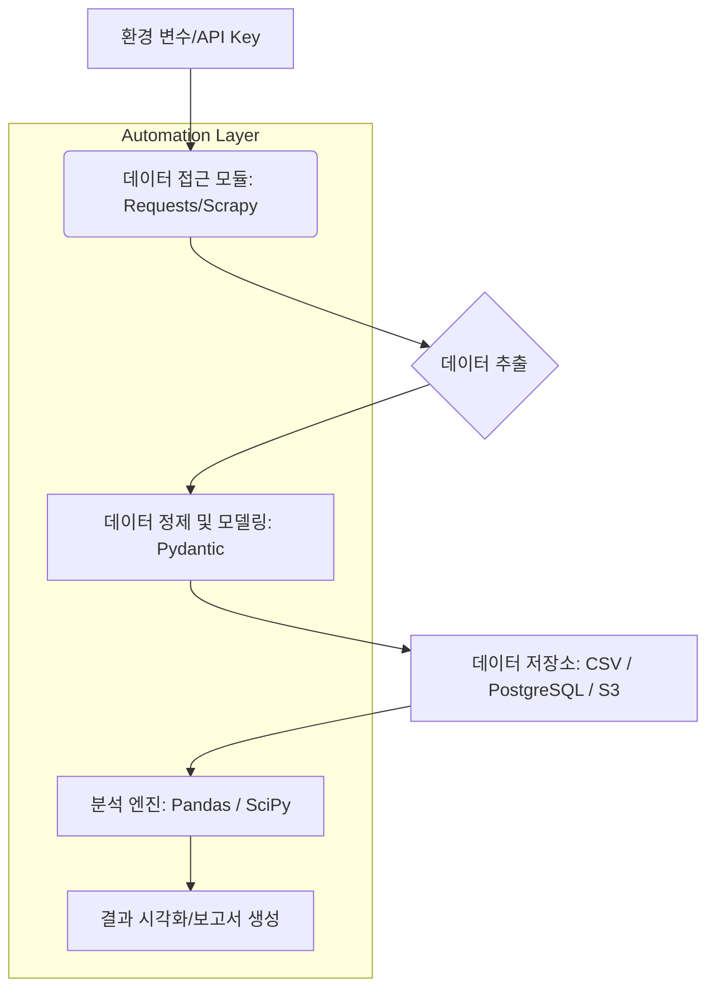

# 💻 Developer — 연구 결과를 바탕으로, 데이터 접근 및 분석 작업을 수행하기 위한 Python 기반의 자동화 스크립트 또는 확장 프로그램 구현 가능성을 기술적으로 평가하고 초기 아키텍처를 제시하라.

💻 Developer: 작업 시작합니다.

## 기술 평가 및 초기 아키텍처 제안: 데이터 접근 및 분석 자동화 시스템

CEO의 지시에 따라, Python 기반의 데이터 접근 및 분석 작업을 자동화하기 위한 기술적 평가와 초기 아키텍처를 제시합니다. 핵심은 **안정성(Stability), 확장성(Scalability), 보안(Security)**입니다.

### 1. 기술적 평가 (Technical Assessment)

현재 요구사항을 충족시키기 위해 기존에 조사된 라이브러리들을 기반으로 시스템을 구축하는 것이 가장 효율적입니다.

| 영역 | 권장 도구/방법론 | 평가 및 선택 이유 |
| :--- | :--- | :--- |
| **데이터 접근 (Extraction)** | `requests`, `aiohttp` (비동기), `Scrapy` (대규모 크롤링 시) | **가장 중요:** API 통신은 `requests`로 시작하여 안정성을 확보하고, 대량 작업이나 동시 요청이 필요할 경우 `aiohttp` 또는 `Scrapy`로 확장합니다. 보안을 위해 모든 키는 환경변수로 관리합니다. |
| **데이터 정제/모델링 (Transformation)** | `pydantic`, Pandas | 데이터의 구조화 및 유효성 검사(Validation)에 필수적입니다. 특히 `pydantic`을 사용하여 API 응답이나 수집된 데이터를 강력하게 모델링하여 후속 분석 단계의 오류를 최소화합니다. |
| **자동화/오케스트레이션 (Orchestration)** | 순수 Python 스크립트, `schedule` 라이브러리 | 초기 단계에서는 복잡한 워크플로우를 관리하기 위해 자체 스크립트를 작성하되, 반복 실행을 위해 스케줄링 기능을 통합합니다. |
| **분석 및 시각화 (Analysis)** | Pandas, Matplotlib/Seaborn | 데이터 수집 후에는 즉시 `Pandas` DataFrame으로 로드하여 통계 분석 및 기본적인 시각화를 수행합니다. |

### 2. 초기 아키텍처 제안: 파이프라인 기반 접근 (Pipeline-Based Approach)

데이터 수집부터 저장, 분석에 이르는 과정을 모듈화된 파이프라인 형태로 설계합니다. 이는 향후 데이터 소스가 추가되거나 분석 요구사항이 복잡해질 때 시스템을 쉽게 확장할 수 있게 합니다.

#### 🚀 아키텍처 다이어그램 (Conceptual Flow)

#### 🧱 모듈별 상세 설계 (Implementation Details)

**Module 1: Data Access Layer (`data_access.py`)**
*   **역할:** 외부 API 또는 웹에서 원시 데이터를 안전하게 가져옵니다.
*   **핵심 기능:** 환경 변수에서 키를 읽어와 `requests` 또는 `aiohttp`를 사용하여 HTTP 요청을 수행합니다. 에러 처리(4xx, 5xx)는 반드시 포함해야 합니다.

**Module 2: Data Model Layer (`models.py`)**
*   **역할:** 수집된 데이터를 Python 객체로 정의하고 유효성을 검사합니다.
*   **핵심 기능:** `pydantic.BaseModel`을 사용하여 API 응답 스키마와 정확히 일치하는 데이터 구조를 강제합니다.

**Module 3: Pipeline Orchestrator (`pipeline.py`)**
*   **역할:** 전체 워크플로우의 흐름을 제어하고 모듈들을 순차적으로 실행합니다.
*   **핵심 기능:** `data_access` → `models` → `storage`의 단계를 관리하며, 중간 단계에서 에러 발생 시 로그를 기록하고 중단하는 로직을 구현합니다.

**Module 4: Storage & Analysis Layer (`storage.py`, `analysis.py`)**
*   **역할:** 데이터를 영구 저장하고 분석을 수행합니다.
*   **핵심 기능:** 추출된 데이터를 `Pandas` DataFrame으로 변환하여 저장소(예: CSV 또는 DB)에 기록한 후, 통계 연산을 수행합니다.

### 3. Python 확장 프로그램 구현 방안 (Extension Implementation Plan)

사용자가 요청한 '파이썬 확장 프로그램'의 관점에서 볼 때, 복잡한 ETL 파이프라인 자체를 확장 프로그램으로 만들기보다는, **자동화된 스크립트 실행 환경 및 인터페이스**를 제공하는 것이 더 실용적입니다.

1.  **CLI 기반 자동화 (Primary Focus):**
    *   모든 핵심 로직은 `pipeline.py`와 같은 Python 스크립트로 작성합니다.
    *   사용자는 터미널에서 간단한 명령어(`python pipeline.py --source=api_endpoint`)만으로 전체 파이프라인을 실행할 수 있도록 만듭니다. (가장 빠르고 안정적인 방법)

2.  **Streamlit/Gradio 기반 인터페이스 (Secondary Focus):**
    *   데이터 분석 결과를 시각적으로 확인하고, 어떤 데이터 소스를 선택할지 GUI를 제공하기 위해 `Streamlit`을 활용합니다.
    *   사용자는 복잡한 코드를 몰라도 대시보드에서 파이프라인의 실행 상태와 최종 분석 결과를 확인할 수 있습니다.

---
📊 평가: 진행중 — 초기 아키텍처는 명확하나, 실제 코드 구현 및 보안 세부 사항(API 키 관리)에 대한 구체적인 스크립트 작성이 필요함.
📝 다음 단계: `data_access.py` 모듈을 환경 변수를 이용한 안전한 API 호출 예제 코드로 구현하고 테스트합니다.
